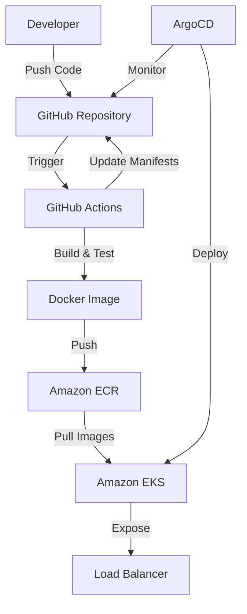

# GitOps Project with AWS EKS, ECR, Docker, Kubernetes, Terraform, and ArgoCD

[](https://github.com/soodrajesh/gitops-project-1/actions/workflows/ci-cd.yml)

A complete GitOps demonstration project showcasing modern cloud-native development practices with AWS services, Kubernetes, and automated CI/CD pipelines.

## 🏗️ Architecture Overview

This project implements a full GitOps workflow with:

- **Infrastructure as Code**: Terraform for AWS resource provisioning
- **Containerization**: Docker for application packaging
- **Container Registry**: Amazon ECR for image storage
- **Orchestration**: Amazon EKS for Kubernetes cluster management
- **CI/CD Pipeline**: GitHub Actions for automated testing and deployment
- **GitOps**: ArgoCD for declarative application deployment
- **Monitoring**: Built-in health checks and metrics endpoints



## 📁 Project Structure

```bash
.
├── .github/workflows/
│   └── ci-cd.yml                 # GitHub Actions CI/CD pipeline
├── terraform/
│   ├── providers.tf              # Terraform provider configuration
│   ├── variables.tf              # Terraform variables
│   ├── eks-cluster.tf            # EKS cluster and node group
│   ├── ecr-repository.tf         # ECR repository with lifecycle policies
│   └── vpc-network.tf            # VPC, subnets, and networking
├── deploy/
│   ├── deployment.yaml           # Kubernetes deployment manifest
│   ├── service.yaml              # Kubernetes service manifest
│   ├── ingress.yaml              # Ingress configuration
│   └── values.yaml               # Helm values for customization
├── argocd/
│   └── app.yaml                  # ArgoCD Application manifest
├── docker/
│   └── Dockerfile                # Multi-stage Docker build
├── scripts/
│   └── deploy.sh                 # Deployment automation script
├── app.py                        # Flask web application
├── requirements.txt              # Python dependencies
├── test_app.py                   # Unit tests
└── .gitignore                    # Git ignore patterns
```

## 🚀 Quick Start

### Prerequisites

- **AWS Account** with appropriate IAM permissions
- **AWS CLI** v2.x configured with credentials
- **Terraform** v1.0+ installed
- **Docker** 20.10+ installed
- **kubectl** installed and configured
- **Python** 3.8+ for local development
- **Git** for version control

### 1. Clone the Repository

```bash
git clone https://github.com/soodrajesh/gitops-project-1.git
cd gitops-project-1
```

### 2. Set Up AWS Infrastructure

```bash
# Navigate to terraform directory
cd terraform

# Initialize Terraform
terraform init

# Review the planned changes
terraform plan

# Apply the infrastructure
terraform apply

# Note the outputs (ECR repository URL, EKS cluster name, etc.)
terraform output
```

### 3. Configure GitHub Secrets

Set up the following secrets in your GitHub repository:

- `AWS_ROLE_ARN`: IAM role ARN for GitHub Actions OIDC
- `AWS_REGION`: Your AWS region (default: eu-west-1)

### 4. Local Development

```bash
# Create virtual environment
python -m venv venv
source venv/bin/activate  # On Windows: venv\Scripts\activate

# Install dependencies
pip install -r requirements.txt

# Run the application locally
python app.py

# Run tests
pip install pytest pytest-cov flake8
pytest
```

### 5. Deploy with GitHub Actions

1. Push your code to the `main` branch
2. GitHub Actions will automatically:
   - Run tests and linting
   - Build and push Docker image to ECR
   - Update Kubernetes manifests
   - Deploy to EKS cluster

## 🔧 Configuration

### Terraform Variables

Customize your deployment by modifying `terraform/variables.tf` or creating a `terraform.tfvars` file:

```hcl
aws_region = "us-west-2"
environment = "production"
cluster_name = "my-gitops-cluster"
node_group_desired_size = 3
node_group_instance_types = ["t3.medium"]
```

### Application Configuration

The Flask application supports the following environment variables:

- `ENVIRONMENT`: Deployment environment (development/production)
- `APP_VERSION`: Application version
- `PORT`: Server port (default: 80)
- `DEBUG`: Enable debug mode (default: False)

## 📊 Monitoring and Health Checks

The application includes built-in monitoring endpoints:

- `GET /health` - Health check for Kubernetes probes
- `GET /api/info` - Application information and metadata
- `GET /api/metrics` - Basic application metrics
- `GET /` - Main application dashboard

### Kubernetes Health Checks

```yaml
livenessProbe:
  httpGet:
    path: /health
    port: 80
  initialDelaySeconds: 30
  periodSeconds: 10

readinessProbe:
  httpGet:
    path: /health
    port: 80
  initialDelaySeconds: 5
  periodSeconds: 5
```

## 🔄 GitOps Workflow

1. **Code Changes**: Developer pushes code to GitHub
2. **CI Pipeline**: GitHub Actions runs tests and builds Docker image
3. **Image Push**: Built image is pushed to Amazon ECR
4. **Manifest Update**: CI pipeline updates Kubernetes manifests with new image tag
5. **ArgoCD Sync**: ArgoCD detects changes and deploys to EKS cluster
6. **Rollout**: Kubernetes performs rolling update with zero downtime

## 🛠️ Manual Deployment Commands

### Docker Commands

```bash
# Build the Docker image
docker build -f docker/Dockerfile -t gitops-demo:latest .

# Run locally
docker run -p 8080:80 gitops-demo:latest

# Push to ECR (replace with your ECR URI)
aws ecr get-login-password --region eu-west-1 | docker login --username AWS --password-stdin <account-id>.dkr.ecr.eu-west-1.amazonaws.com
docker tag gitops-demo:latest <account-id>.dkr.ecr.eu-west-1.amazonaws.com/gitops-project-1:latest
docker push <account-id>.dkr.ecr.eu-west-1.amazonaws.com/gitops-project-1:latest
```

### Kubernetes Commands

```bash
# Update kubeconfig
aws eks update-kubeconfig --region eu-west-1 --name gitops-demo-cluster

# Deploy manually
kubectl apply -f deploy/deployment.yaml
kubectl apply -f deploy/service.yaml

# Check deployment status
kubectl get pods
kubectl get services
kubectl logs -f deployment/gitops-demo-app

# Scale the deployment
kubectl scale deployment gitops-demo-app --replicas=5
```

### ArgoCD Setup

```bash
# Install ArgoCD
kubectl create namespace argocd
kubectl apply -n argocd -f https://raw.githubusercontent.com/argoproj/argo-cd/stable/manifests/install.yaml

# Get ArgoCD admin password
kubectl -n argocd get secret argocd-initial-admin-secret -o jsonpath="{.data.password}" | base64 -d

# Port forward to access ArgoCD UI
kubectl port-forward svc/argocd-server -n argocd 8080:443

# Apply the ArgoCD application
kubectl apply -f argocd/app.yaml
```

## 🔒 Security Considerations

- **IAM Roles**: Uses least-privilege IAM roles for all AWS services
- **Network Security**: Private subnets for worker nodes with NAT gateways
- **Container Security**: ECR image scanning enabled
- **Secrets Management**: GitHub secrets for sensitive configuration
- **RBAC**: Kubernetes RBAC policies for service accounts
- **TLS**: All communications encrypted in transit

## 🧪 Testing

```bash
# Run unit tests
pytest test_app.py -v

# Run with coverage
pytest --cov=app --cov-report=html

# Lint code
flake8 app.py test_app.py

# Integration testing
curl http://localhost:8080/health
curl http://localhost:8080/api/info
```

## 📈 Performance and Scaling

- **Horizontal Pod Autoscaler**: Automatically scales based on CPU/memory
- **Cluster Autoscaler**: Scales EKS nodes based on demand
- **Load Balancing**: AWS Load Balancer distributes traffic
- **Resource Limits**: Configured resource requests and limits

## 🔍 Troubleshooting

### Common Issues

1. **ECR Authentication**: Ensure AWS credentials are properly configured
2. **EKS Access**: Check IAM roles and kubeconfig setup
3. **Image Pull Errors**: Verify ECR repository permissions
4. **Pod Startup Issues**: Check resource limits and health check endpoints

### Debug Commands

```bash
# Check cluster status
kubectl cluster-info

# Describe problematic pods
kubectl describe pod <pod-name>

# View logs
kubectl logs -f deployment/gitops-demo-app

# Check events
kubectl get events --sort-by=.metadata.creationTimestamp
```

## 🤝 Contributing

1. Fork the repository
2. Create a feature branch (`git checkout -b feature/amazing-feature`)
3. Commit your changes (`git commit -m 'Add amazing feature'`)
4. Push to the branch (`git push origin feature/amazing-feature`)
5. Open a Pull Request

## 📄 License

This project is licensed under the MIT License - see the [LICENSE](LICENSE) file for details.

## 🙏 Acknowledgments

- AWS EKS team for excellent Kubernetes service
- ArgoCD community for GitOps best practices
- Terraform community for infrastructure as code patterns
- GitHub Actions team for seamless CI/CD integration

---

**Built with ❤️ for the DevOps community**

Accessing the Application

    Ingress URL: The application is exposed through an Ingress resource. Access it using the hostname defined in deploy/ingress.yaml.

CI/CD Pipeline

    The pipeline is configured in .github/workflows/ci-cd.yml to automatically build, push Docker images, and deploy the application on code changes.