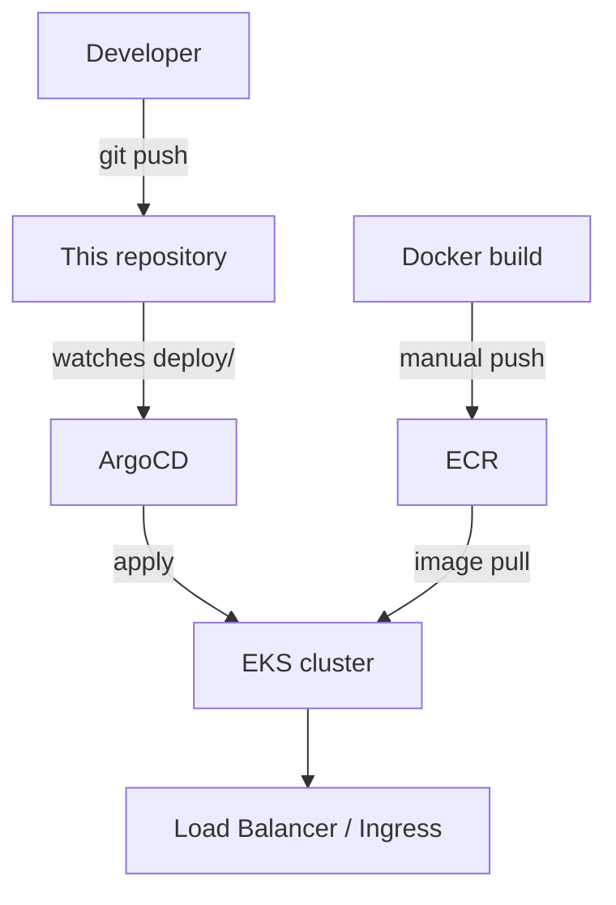

# EKS GitOps Deployment with ArgoCD

A small Flask app deployed to EKS the GitOps way: Terraform provisions the cluster and
registry, ArgoCD watches the `deploy/` manifests in this repo and reconciles the cluster
to match. The app itself is intentionally trivial (a health check and a couple of JSON
endpoints) — the point of this repo is the deployment path around it, not the app.

## Architecture



Terraform sets up:
- A VPC with public and private subnets across multiple AZs, private subnets routed
  through a NAT gateway so worker nodes don't need public IPs.
- An EKS cluster with control-plane logging enabled and secrets encrypted with a
  dedicated KMS key.
- An ECR repository with scan-on-push enabled and a lifecycle policy that expires
  untagged images after a day and keeps the last 10 tagged releases.

ArgoCD is pointed at the `deploy/` directory as plain Kubernetes manifests (no Helm —
there's no chart here, just a Deployment, Service, and Ingress). `syncPolicy.automated`
is set with `prune` and `selfHeal`, so ArgoCD both applies new commits and reverts
manual `kubectl` changes that drift from what's in git.

What this doesn't have: a CI pipeline. There's no GitHub Actions workflow in this repo,
so building and pushing the image to ECR is a manual step (see commands below) before
ArgoCD can deploy it. Wiring that up would be the natural next piece.

## Project structure

```
.
├── terraform/         VPC, EKS cluster, ECR, KMS key
├── deploy/            Kubernetes manifests ArgoCD applies (Deployment, Service, Ingress)
├── argocd/            ArgoCD Application definition pointing at deploy/
├── docker/            Dockerfile for the Flask app
├── scripts/deploy.sh  Manual kubectl-based deploy, useful without ArgoCD for testing
├── app.py             The Flask app
└── test_app.py        Unit tests for the app's endpoints
```

## Running it

```bash
cd terraform
terraform init
terraform apply
terraform output ecr_repository_url    # note this and the cluster name

aws eks update-kubeconfig --region <region> --name <cluster_name_from_output>

# build and push the image
docker build -f docker/Dockerfile -t <ecr_repository_url>:latest .
aws ecr get-login-password --region <region> | docker login --username AWS --password-stdin <ecr_repository_url>
docker push <ecr_repository_url>:latest
```

Then either install ArgoCD and apply `argocd/app.yaml` and let it sync, or run
`scripts/deploy.sh` for a plain `kubectl apply` without GitOps in the loop.

Before applying `deploy/deployment.yaml`, replace `PLACEHOLDER_ECR_URI` with the actual
repository URL from the Terraform output. The ingress host in `deploy/ingress.yaml` is
also a placeholder (`myapp.example.com`) — point it at a real domain if you're testing
with an ingress controller.

## App endpoints

- `GET /` — a small HTML status page
- `GET /health` — used by the liveness/readiness probes
- `GET /api/info` — app version, environment, pod name as JSON
- `GET /api/metrics` — uptime and basic metadata

## Tests

```bash
pip install -r requirements.txt pytest
pytest test_app.py -v
```

## Known gaps

- No CI/CD pipeline — image build/push is manual, described above.
- Single environment only; there's no per-environment Terraform workspace or
  overlay, so running this for more than a demo would need that split out.
- The ingress host and image URI are placeholders that need to be filled in per
  deployment rather than being templated automatically.
